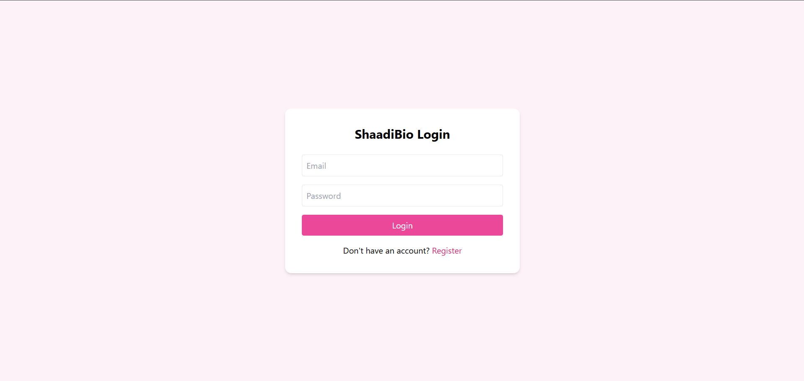
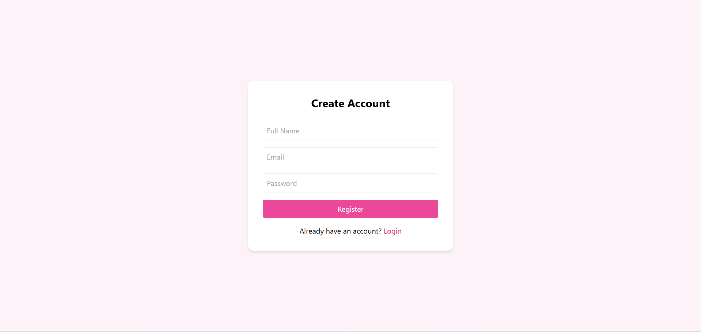
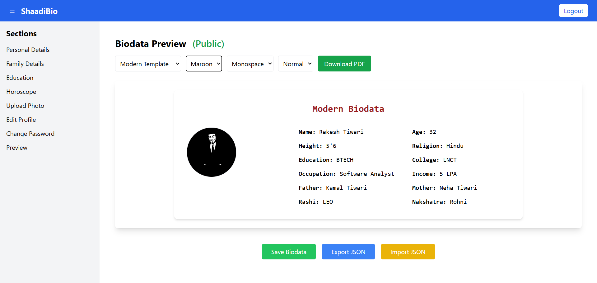
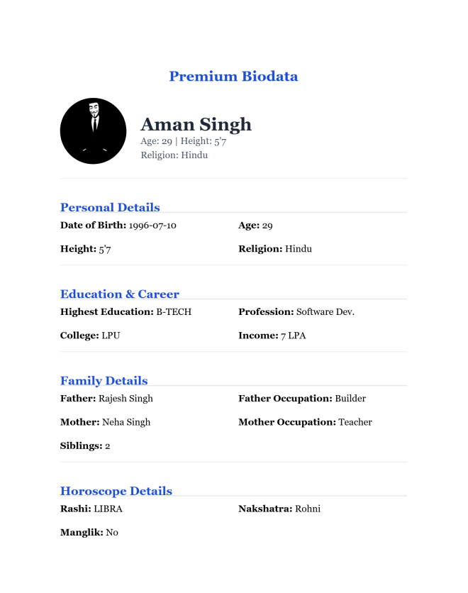
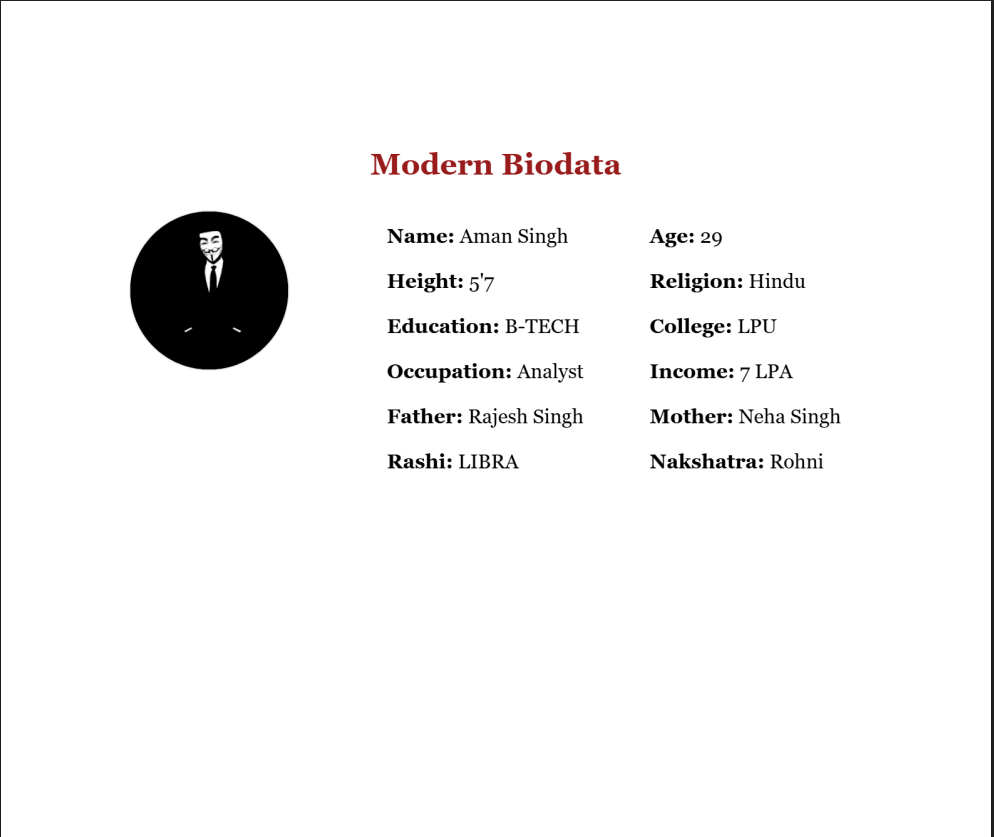
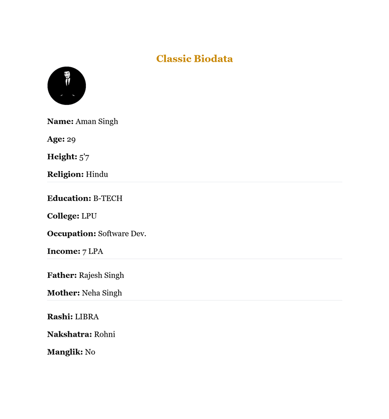

# ShaadiBio - MERN Biodata Generator

ShaadiBio is a full-stack MERN application that allows users to create, manage, and export professional marriage biodata profiles. Users can register, log in securely, fill biodata details, preview them, upload photos, and generate a downloadable PDF.

---

## 🚀 Live Demo

Frontend + Backend (after deployment)

```
https://your-app.onrender.com
```

---

## 📸 Screenshots

### Login Page


### Register Page


### Preview


### Biodata-Pdf


### Biodata-Pdf


### Biodata-Pdf



## 🔧 Setup

### Backend

1. `cd backened`
2. Create a `.env` file based on `.env.example` and fill in values (do **not** commit `.env`).
3. `npm install`
4. `npm run dev` to start the API on port 5000.

The server automatically creates a default admin user if none exists. Credentials come from `ADMIN_EMAIL`/`ADMIN_PASSWORD`  env vars (defaults to admin@example.com/admin123).

### Frontend

1. `cd frontened`
2. `npm install`
3. `npm run dev` to start Vite (default port 5173).

The frontend expects the API at `http://localhost:5000` by default.

## Build Frontend for Production

```
cd frontened
npm run build
```

Copy the generated `dist` folder to:

```
backend/frontened-build
```

---

## ✨ Features

- User registration, login, logout
- Personal/family/education/horoscope forms with validation
- Profile photo upload with size/type restrictions
- Privacy toggle (`public` flag) per biodata
- Three templates with color themes, font & text-size customization
- Dynamic preview with PDF download
- Save/edit biodata to backend
- Pagination/filtering & admin-only APIs
- Export/import biodata JSON
- Profile editing, password change, admin promotion
- JWT expiration handling, input validation, rate limiting, CORS

## 🛠 Tech Stack

**Frontend**

* React
* Vite
* Context API
* CSS

**Backend**

* Node.js
* Express.js
* JWT Authentication

**Database**

* MongoDB
* MongoDB Atlas (Cloud Database)

**Other Tools**

* PDF Generation
* REST API
* Git & GitHub

---


## API Endpoints

### Auth
- `POST /api/auth/register` - register user
- `POST /api/auth/login` - login
- `GET /api/auth` - list users (admin only, supports `page`, `limit`, `email`)
- `GET /api/auth/:id` - single user (admin only)
- `PUT /api/auth/me` - update profile (auth required)
- `PUT /api/auth/me/password` - change password
- `PUT /api/auth/:id/promote` - promote to admin (admin only)

### Biodata
- `POST /api/biodata/create` - create biodata (auth)
- `GET /api/biodata/user` - fetch own biodata (auth)
- `GET /api/biodata` - list biodata (auth; only public items shown to non-admins)
- `GET /api/biodata/user/:userId` - fetch another user's biodata (admin or owner)
- `PUT /api/biodata/:id` - update biodata (owner/admin)
- `DELETE /api/biodata/:id` - delete biodata (owner/admin)


## Notes

- `.env` is ignored; use `.env.example` for guidance.
- To seed data, you can register via the frontend or the API and then update fields.
- The code includes basic validation and error handling, but more production hardening is advised.

## 🌐 Deployment

The project can be deployed using:

* Backend + Frontend: Render
* Database: MongoDB Atlas


## 💡 Project Highlights

- Built a full-stack MERN application
- Implemented secure JWT authentication
- Designed RESTful APIs using Express.js
- Generated downloadable biodata PDFs
- Deployed full application on Render
- Used MongoDB Atlas for cloud database


## 👨‍💻 Author

Ritik Kumar

GitHub:
https://github.com/Ritik-Gswmi


## 📄 License

This project is open source and available under the MIT License.